# RAID 10 IMPLEMENTATION

### Introduction
*RAID 10, also known as RAID 1+0, combines the advantages of RAID 1 (mirroring) and RAID 0 (striping). It requires at least four disks. The array mirrors the data across pairs of disks for redundancy and stripes it for performance.*

### Advantages:
  - High performance due to striping.
  - High redundancy due to mirroring.

### Disadvantages:
  - Expensive since half the total storage is used for redundancy.


<br>

### Prerequisites
- *4 disks available (e.g., /dev/sdb, /dev/sdc, /dev/sdd, /dev/sde).*
- *Linux utility mdadm installed to manage RAID arrays.*


## Steps and Commands for RAID 10 Implementation

<br>


### . Install mdadm
```yml
sudo apt-get update
sudo apt-get install mdadm
```
### 2. Create the RAID 10 Array
  - Use the following command to create the RAID 10 array:

```yml
sudo mdadm --create --verbose /dev/md0 --level=10 --raid-devices=4 /dev/sdb /dev/sdc /dev/sdd /dev/sde
```
  - Explanation:
    - --create: Creates a new RAID array.
    - --verbose: Displays detailed output.
    - /dev/md0: Specifies the RAID device name.
    - --level=10: Defines the RAID level as 10.
    - --raid-devices=4: Uses 4 disks for the array.
    - /dev/sdb ... /dev/sde: Disks included in the array.

### 3. Verify the RAID Array
  - Check the RAID array details:

```yml
sudo mdadm --detail /dev/md0
```
  - To confirm the RAID device, use:

```yml
lsblk
```
### 4. Format the RAID Array
  - Create an ext4 filesystem on the RAID array:

```yml
sudo mkfs.ext4 /dev/md0
```
### 5. Mount the RAID Array
  - Create a mount point and mount the RAID array:

```yml
sudo mkdir /mnt/raid10
sudo mount /dev/md0 /mnt/raid10
```
  - Verify the mount:

```yml
df -h
```
### 6. Test the RAID Array
  - Create a test file to confirm the RAID functionality:

```yml
sudo touch /mnt/raid10/testfile.txt

sudo ls /mnt/raid10
```
  - Disk Failure and Replacement Scenario

### 7. Simulate Disk Failure
  - Remove a disk (e.g., /dev/sdb) from the array:

```yml
sudo mdadm /dev/md0 --remove /dev/sdb    # OR remove from storage setting(VM)
```
  - Check the RAID status:
```yml
sudo mdadm --detail /dev/md0
```

### 8. Replace the Failed Disk
  - Add the failed disk back to the array:

```yml
sudo mdadm /dev/md0 --add /dev/sdb
```
### 9. Monitor Rebuilding
Track the rebuild process:

```yml
watch cat /proc/mdstat
```
  - Final Verification
        - After rebuilding, ensure the RAID array is "clean" and data is intact:

```yml
sudo mdadm --detail /dev/md0

cat /mnt/raid10/testfile.txt
```

<br>

#### Notes
- RAID 10 allows one disk per mirrored pair to fail without data loss.
- Monitor RAID health regularly using mdadm --detail and /proc/mdstat.


<br>

<br>

## Conclusion

*RAID 10 provides a robust balance of performance and redundancy, making it ideal for critical systems requiring high data throughput and reliability. These commands set up a fully functional RAID 10 array to leverage its capabilities effectively.*


<br>

<br>

<br>


## ------------------Screnshots--------------------
1.
<br>
<br>


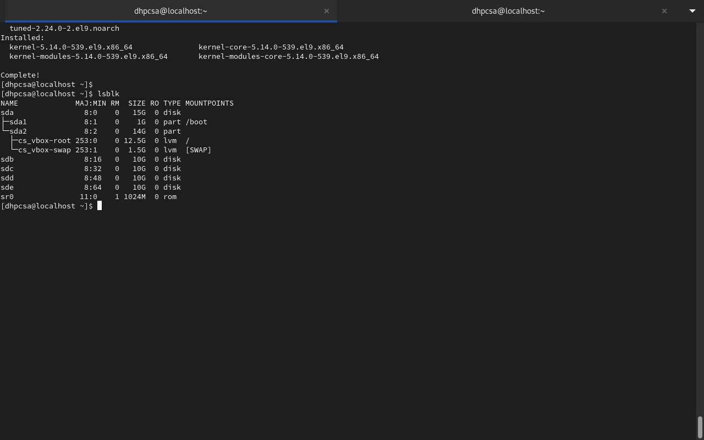

2.
<br>
<br>


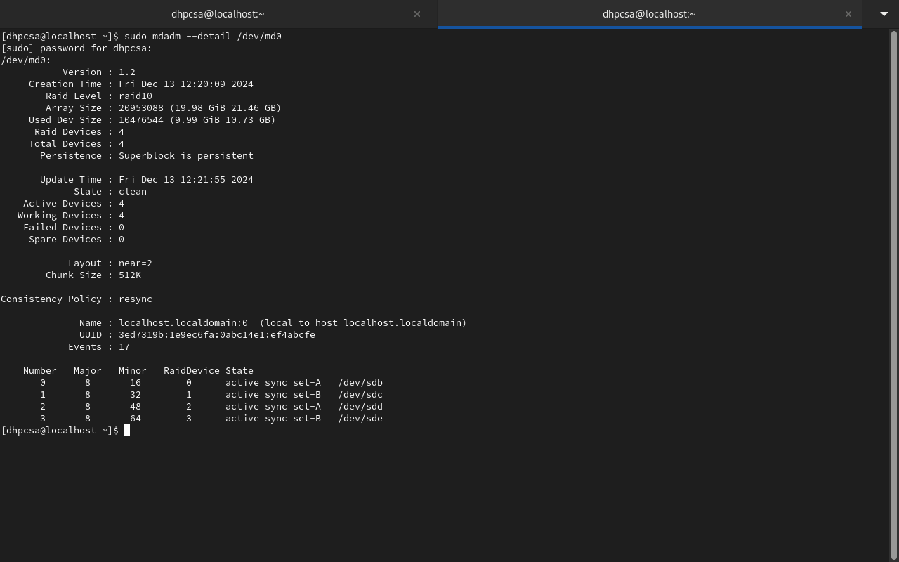


<br>
<br>

3.
<br>
<br>


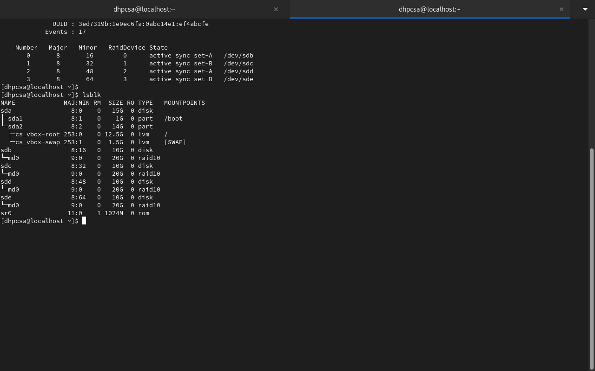

4.
<br>
<br>


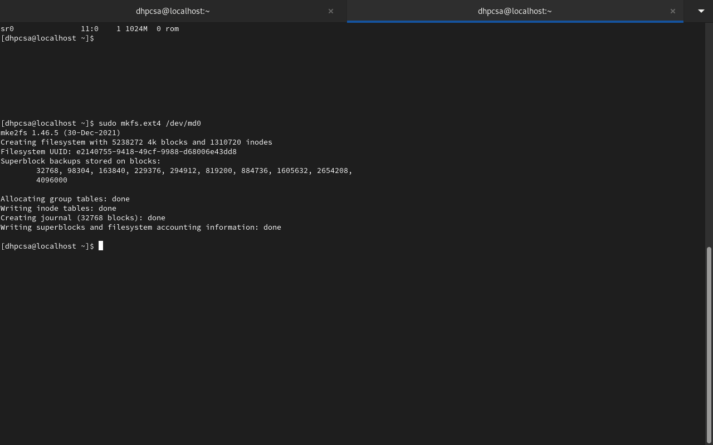


5.
<br>
<br>


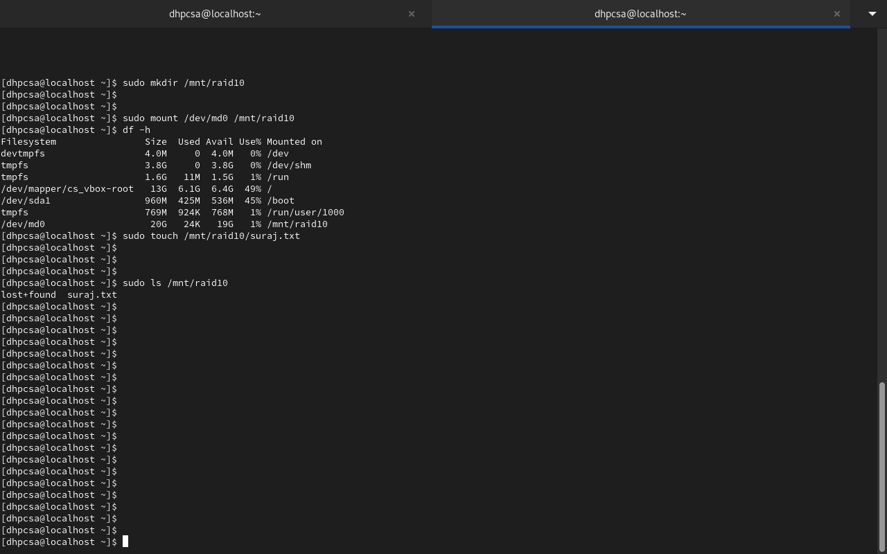

6.
<br>
<br>

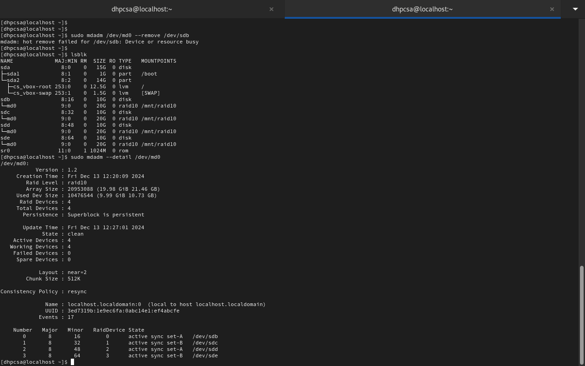

7.
<br>
<br>


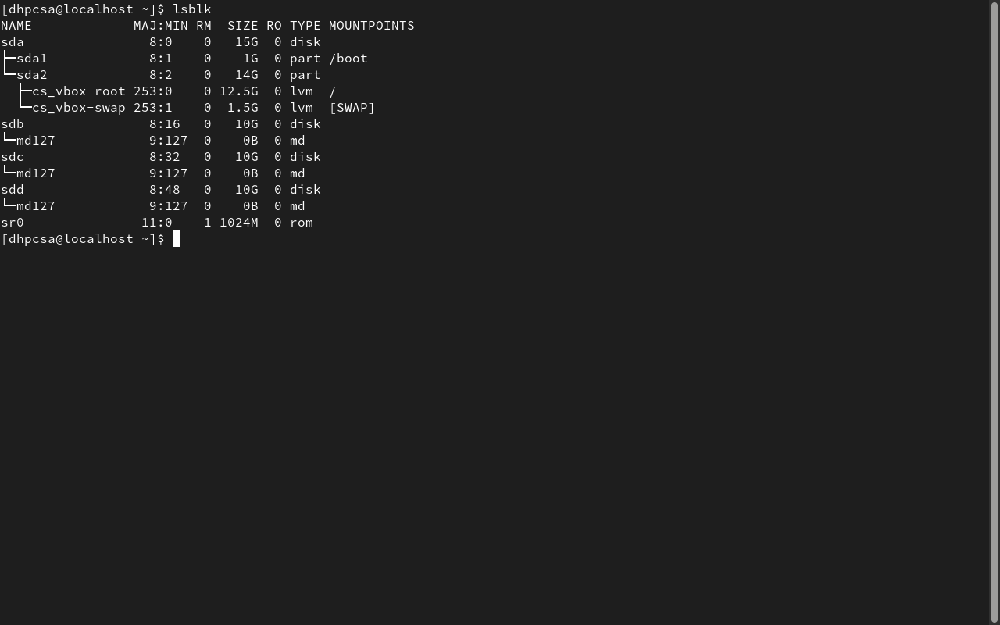

8.
<br>
<br>


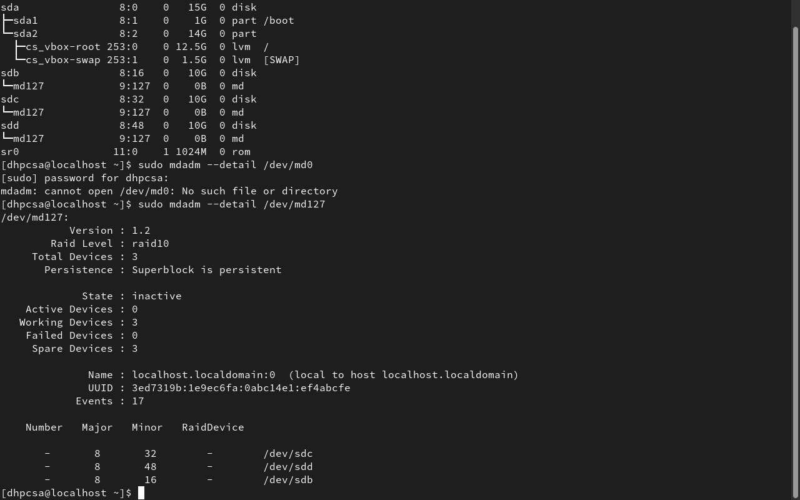

9.
<br>
<br>


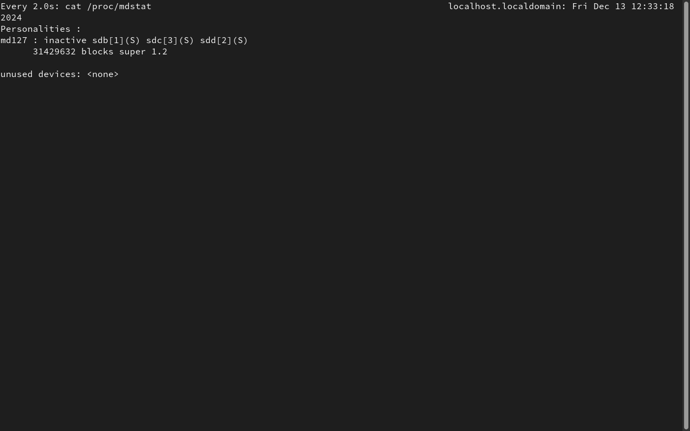

10.
<br>
<br>

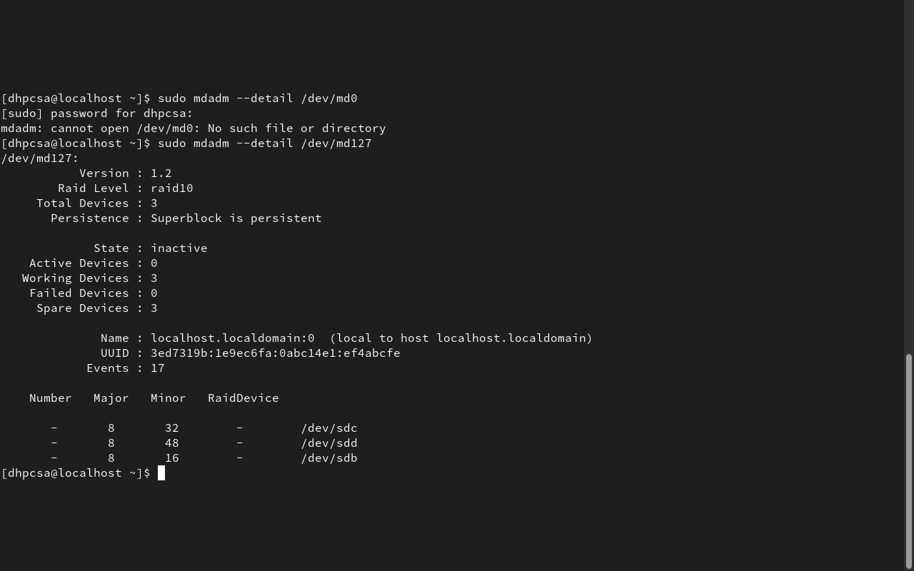


<br>
<br>


11.
<br>
<br>

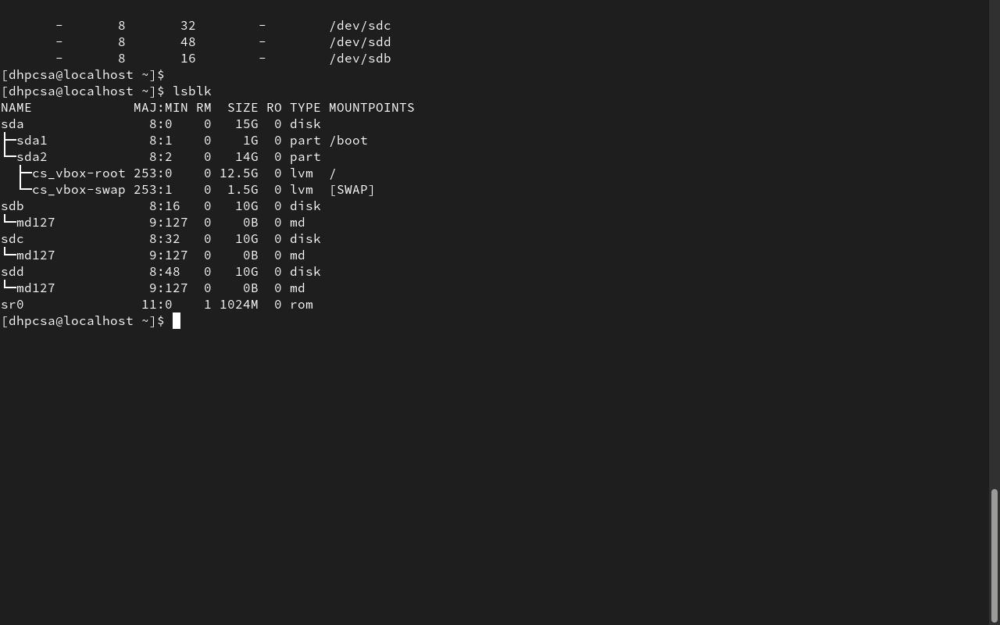

12.
<br>
<br>


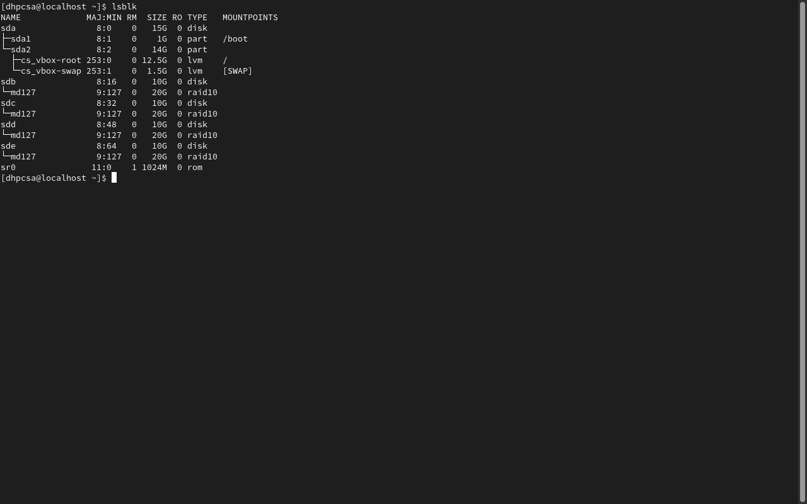

13.
<br>
<br>


14.
<br>
<br>


15.
<br>
<br>


